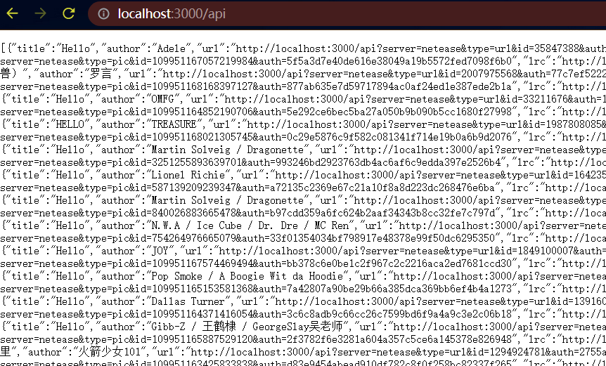
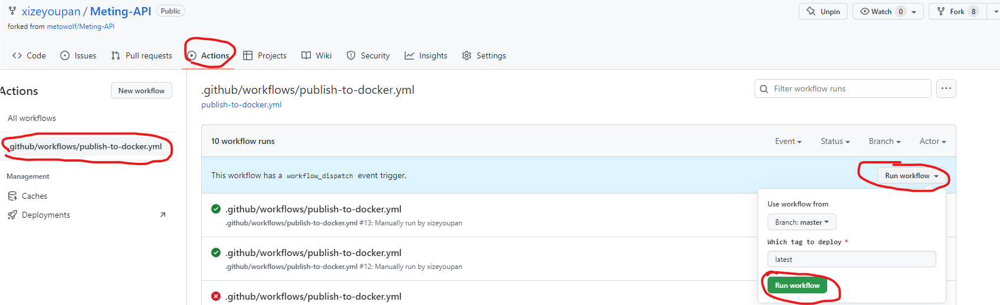
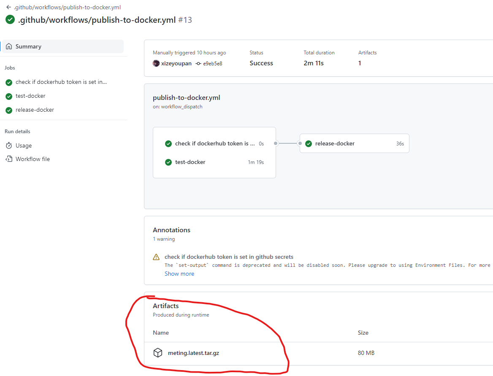
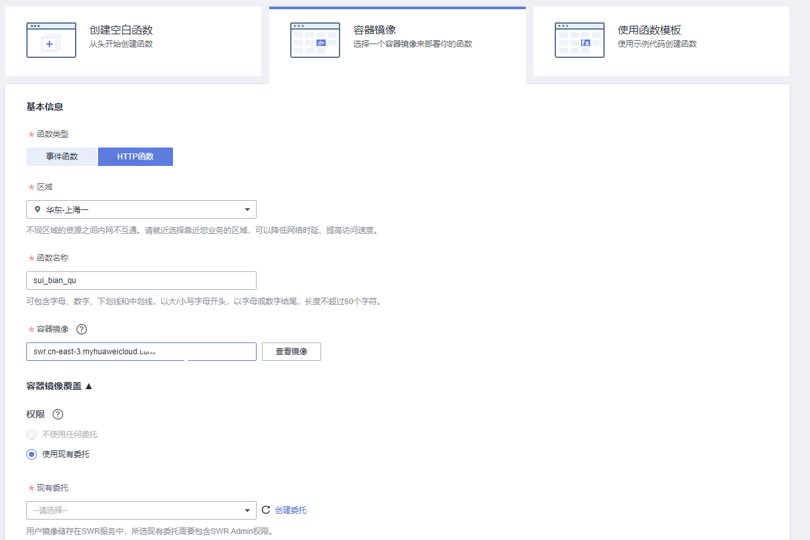
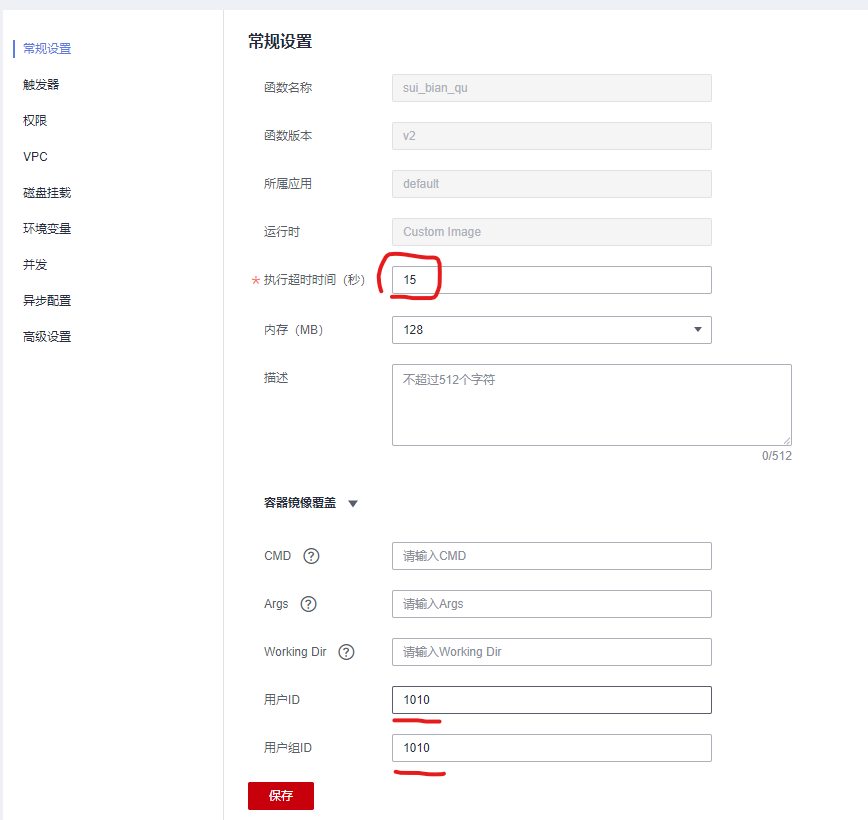
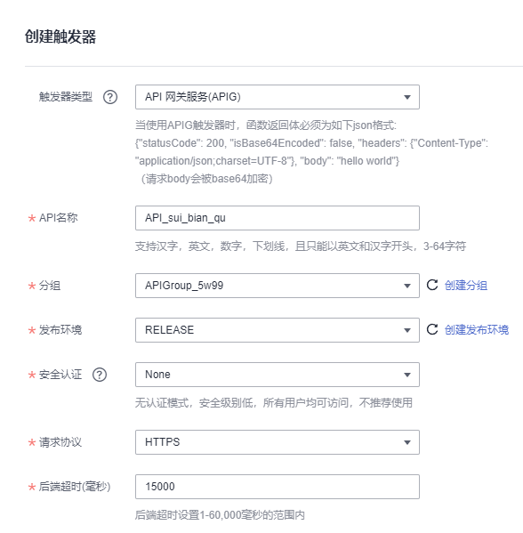
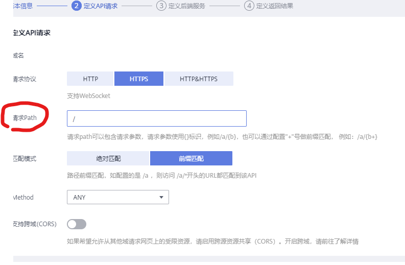

# Meting-API

## 写在前面

Meting后端的api结构较为复杂，基础是一个[接口](https://github.com/metowolf/Meting/blob/master/src/Meting.php)，原作者在此基础上增加了[php后端](https://github.com/metowolf/Meting-API/blob/master/api/root/var/www/meting/public/index.php)，又用node做了一层[wrapper](https://github.com/metowolf/Meting-API/tree/master/server)。

同时可以发现原作者在docker hub上传了php后端的[镜像](https://hub.docker.com/r/metowolf/meting)，但没有node的镜像（仓库中仍有Dockerfile）。

原作者大佬的api服务可能不太稳定，于是我在上面两个Dockerfile的基础上新生成了单一的Dockerfile，仅仅对外暴露一个3000端口。并且微改了一些代码，适配了vercel的serverless function。

## 部署

部署 Meting-API 需要基本的计算机编程常识，如果您在部署过程中遇到无法解决的问题请到 issues 向我们提问，我们会尽快给您答复。

如果部署成功，在你的域名后拼接上`/api`，理论上出现类似下图数据：



### 手动部署

由于该项目既有php又有node，且原来代码各层级之间的api关系不太清晰，这里不建议手动部署。

### Docker部署

运行下面的命令下载 Meting-API 镜像

```
docker pull intemd/meting-api:latest
```

然后运行 Meting-API 即可

```
docker run -d --name meting -p 3000:3000 intemd/meting-api:latest
```

在浏览器中打开 http://localhost:3000/api 来进行测试 ✅

### 部署到vercel

<a href="https://vercel.com/import/project?template=https://github.com/xizeyoupan/Meting-API"></a>

由于ip不在大陆，**理论上除了网易云外其他音乐源均不可用🥲**解决方法请看下一节部署到国内平台。

### 部署到国内平台

目前国内云服务商呈现两超多强的态势。本人到官方文档翻来翻去，发现各厂商免费的云函数服务是越来越少了，腾讯云免费额度就[三个月](https://cloud.tencent.com/document/product/583/12282)，阿里云似乎有[一年](https://help.aliyun.com/document_detail/54301.html)。

#### 华为云

> 不是华为我不用。因为他是有良心的，中国制造🫡

目前华为云每个月提供一定的[免费额度](https://support.huaweicloud.com/productdesc-functiongraph/functiongraph_01_0190.html)，包括[日志](https://www.huaweicloud.com/pricing.html?tab=detail#/aom)。

> 爆！爆！爆！这下真的爆了！

👆指的是华为云虽然函数工作流有免费额度，但配套的API网关却不免费，这不刚调试完没多久就发现欠费1分钱，无奈被迫充值了**1元**。理论上1元应该能用挺久的。当然你如果没有1元，也可以选择充1毛试试水。

1. 注册并认证
   - 中国站需要手机验证码+实名认证。
   - 外国站需要手机验证码+可用的Visa/MasterCard/*信用卡。

2. 下载镜像

   - 在github上Fork本项目。
   - 依次点击actions/workflow/run workflow。 
   - 等待CI完成后点进第一个workflow下载artifact。 
   - 从下载的文件中解压出meting.tar.gz。

3. 上传镜像

   - 登录[镜像服务](https://console.huaweicloud.com/swr)，选择页面上传，创建一个名字随意的组织，上传镜像。
   - 点击meting-api，找到下载指令，复制 docker pull 后面的镜像地址。

4. 创建函数

   - 在[函数服务](https://console.huaweicloud.com/functiongraph)点击创建函数。注意类型选**HTTP**。  
   - 区域选国内的，并且后续服务也建议开在相同区域。
   - 镜像填刚刚复制的地址。

5. 创建委托

   - 名称随便。
   - 类型选云服务。
   - 云服务选择"函数工作流 FunctionGraph"。
   - 下一步策略勾选"SWR Admin"即可。
   - 一路完成，返回创建函数页面选择刚创建的委托，创建函数。

6. 设置函数

   - 建议需要调整的设置如下：  
   - 创建触发器，其中分组按提示创建即可。 

7. 设置网关

   - 点击刚创建的APIG触发器，右上角编辑，这里除了改请求path，其他都下一步。 
   - 接着发布API。在API详情界面可以看到你的API URL。在其后加上/api访问，能看到数据就说明成功了。


8. 完成

   总结一下：华为云的这个服务确实又臭又长，对于大公司可能叫生态丰富，体系健全，但对想快速上手的同学确实不太友好。各服务之间的文档分布松散，难以跳转。在我写这段话的时候还突然抽风了几小时，我还以为昨晚能跑的代码怎么睡一觉就不好使了。当然把Meting用js重写可能会是一个更好的选择。

## 使用

在导入[前端插件](https://github.com/metowolf/MetingJS)前，加入

```
<script>
var meting_api='http://example.com/api?server=:server&type=:type&id=:id&auth=:auth&r=:r';
</script>
```

比如

```
<script>
var meting_api='http://localhost:3000/api?server=:server&type=:type&id=:id&auth=:auth&r=:r';
</script>
```

即可。就这样吧，那我去看vtb了，88
